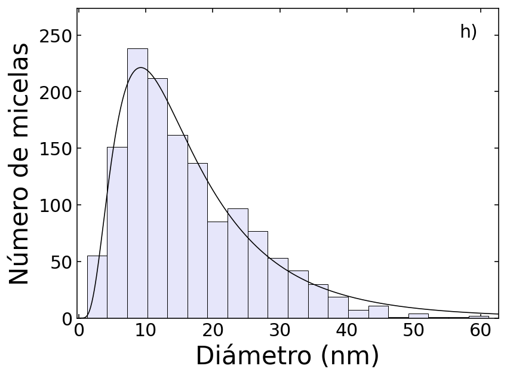

# análisis-datos-TFG

# análisis-datos-TFG

Scripts de Python usados en el análisis de datos experimentales de mi Trabajo de Fin de Grado (Física, USC), centrado en la caracterización de micelas de copolímero de bloque (E33S14E33 y E38S10E38) y su interacción con proteínas plasmáticas (BSA y fibrinógeno).

## Qué hay aquí

- **`tamaños-DLS.py`** — procesa datos de Dispersión Dinámica de Luz (DLS) exportados del Zetasizer y genera la distribución de tamaño por intensidad para una condición experimental dada (proteína, pH, temperatura).
- **`micelas-TEM.py`** — a partir de un histograma de diámetros medidos por TEM, ajusta una distribución log-normal (más adecuada que una gaussiana para tamaños de micelas) y calcula media y desviación estándar de la población.

## Datos de ejemplo

- `fibrinogeno_PBS_37C_10µM_2.txt` — export del Zetasizer usado por `tamaños-DLS.py`.
- `E384.5.txt` — histograma de diámetros (bins y conteos) usado por `micelas-TEM.py`.

## Resultados

**Distribución de tamaño por DLS — fibrinógeno en PBS pH 7.4, 37°C**

**Histograma de diámetros de micelas (TEM) con ajuste log-normal**

## Librerías

Python 3, `pandas`, `numpy`, `matplotlib`, `scipy` (ajuste log-normal con `curve_fit`).

## Notas

Este repositorio recoge una muestra representativa del análisis realizado en el TFG completo, que incluyó además medidas de potencial zeta (ELS/PALS), fluorescencia y calorimetría de titulación isotérmica (ITC) sobre múltiples condiciones experimentales (pH, temperatura, proteína, variante de copolímero).
